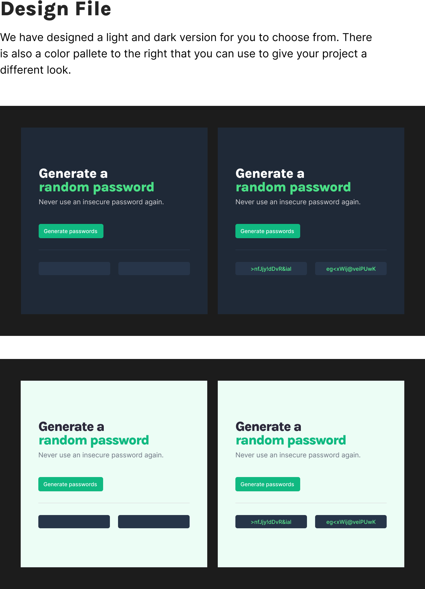

# scrimba-password-generator
Password Generator for Scrimba Front-End Course

## Initial Design

## Requirements
- ☒ Generate two random passwords when user clicks button
- ☒ Each password should be 15 characters long and generate from charset: A-Z,a-z,0-9,~,\`,!,@,#,$,%,^,&,\*,(,),\_,-,+,=,\{,\[,},\],",",\|,:,;,<,>,.,\?,/

- ☒ Set password length
- ☒ copy-on-click
- ☒ Toggle Symbols/numbers
- ☒ Light/Dark Theme